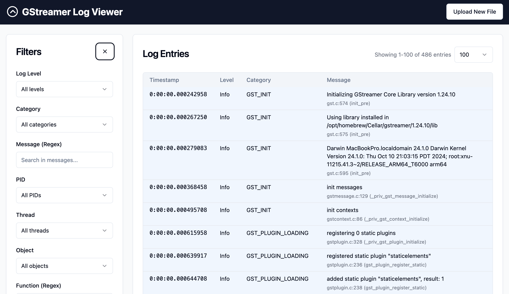

# GStreamer Log Viewer

A web-based viewer for GStreamer log files that allows filtering and analysis of GStreamer application pipeline logs.



## Features

- Upload and parse GStreamer log files
- Filter logs by:
  - Log level
  - Category
  - Message content (regex)
  - PID
  - Thread
  - Object
  - Function name (regex)
- Pagination for efficient navigation through large log files
- Responsive UI with a modern design

## Prerequisites

- Rust (2021 edition)
- Node.js and npm/yarn

## Project Structure

- `src/`: Rust backend code
- `frontend/`: React frontend application

## Setup & Running

### Backend

1. Build the backend:

```bash
cargo build
```

### Frontend

1. Install dependencies:

```bash
cd frontend
npm install
# or
yarn install
```

2. Build the frontend:

```bash
npm run build
# or
yarn build
```

### Running the Application

1. Start the server:

```bash
cargo run
```

2. Open your browser and navigate to http://localhost:3000

## Usage

1. Upload a GStreamer log file using the upload interface
2. Use the filters panel to narrow down the log entries
3. View and paginate through the filtered log entries
4. Adjust the entries per page as needed

## Technical Details

- Backend: Rust with Axum web framework
- Frontend: React with Tailwind CSS and shadcn/ui components
- Parser: Uses the gst-log-parser crate (integrated as a dependency) for parsing GStreamer logs

## License

This project is licensed under the same terms as the underlying gst-log-parser crate (MIT/Apache-2.0).
